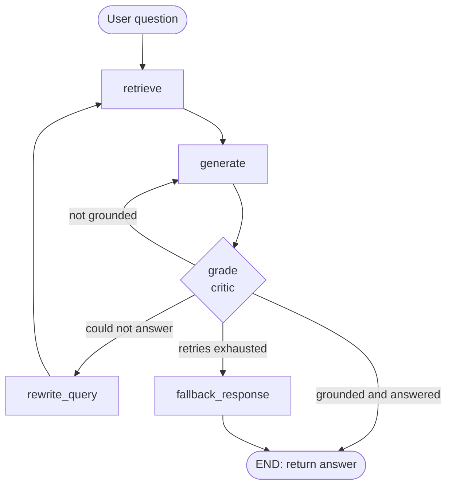

# Self-Healing RAG Pipeline

A Retrieval-Augmented Generation (RAG) pipeline that **audits its own answers** and tries to fix itself before replying. A critic agent checks every answer against the retrieved documents. If the answer is hallucinated, the pipeline regenerates it. If the documents didn't contain the answer, it rewrites the search query and retrieves again. If nothing works, it falls back to an honest "I don't have enough information" instead of making something up.

Built with **LangGraph**, **LangChain**, **FAISS**, **HuggingFace embeddings**, and **Groq**.


---

## Why this project?

A plain RAG pipeline fails silently. It retrieves some chunks, the LLM answers, and nobody checks whether the answer is actually supported by those chunks. In a support or policy setting, a confident wrong answer ("Yes, gift cards are refundable within 30 days") is worse than saying "I don't know".

This project adds a feedback loop so the system can detect and handle two different failure modes:

| Failure mode | What went wrong | How the pipeline heals |
| --- | --- | --- |
| **Hallucination** | Retrieval was fine, but the LLM invented or extrapolated facts | Regenerate from the same documents with a stricter prompt |
| **Retrieval miss** | The retrieved chunks didn't contain the answer | Rewrite the search query and retrieve again |
| **Not in the documents** | The answer genuinely doesn't exist | Stop after the retry limit and return a safe fallback message |

---

## How it works



1. **retrieve**: embeds the search query and fetches the top-2 chunks from FAISS.
2. **generate**: answers using *only* the retrieved context, or says "I don't know."
3. **grade (critic)**: judges two things with structured output:
   - `grounded`: is every claim supported by the context?
   - `answered`: does the answer actually address the question?
4. **Routing** (pure decision function, no state changes):

| Critic verdict | Action |
| --- | --- |
| grounded and answered | return the answer |
| not grounded | `regenerate` (same docs, stricter prompt) |
| grounded but not answered | `rewrite` the search query, then retrieve again |
| retry budget exceeded | `fallback` |

---

## Tech stack

| Layer | Choice |
| --- | --- |
| Orchestration | LangGraph (`StateGraph` with conditional edges) |
| LLM framework | LangChain (prompts, structured output) |
| LLM | `openai/gpt-oss-120b` via Groq (`temperature=0`) |
| Embeddings | HuggingFace `all-MiniLM-L6-v2` (runs locally) |
| Vector store | FAISS |
| Chunking | `RecursiveCharacterTextSplitter` (chunk size 200, overlap 20) |
| Validation | Pydantic (`Grade` schema for the critic) |

---

## Project structure

```text
self-healing-rag/
├── main.py            # pipeline: indexing, nodes, critic, graph, CLI loop
├── app.py             # Streamlit chat UI that shows the healing trace live
├── test_critic.py     # tests the critic in isolation with hand-written answers
├── docs/
│   └── company.txt    # knowledge base (fictional company policies)
├── graph_architecture.png
├── requirements.txt
└── .env               # GROQ_API_KEY (never committed)
```

---

## Setup

```bash
# 1. Clone and enter the project
git clone <your-repo-url>
cd self-healing-rag

# 2. Create a virtual environment
python3 -m venv venv
source venv/bin/activate

# 3. Install dependencies
pip install -r requirements.txt

# 4. Add your Groq API key
echo "GROQ_API_KEY=your_key_here" > .env

# 5a. Run the command-line version
python3 main.py

# 5b. Or run the Streamlit web UI (from the project root)
streamlit run app.py
```

The UI streams every graph node as it finishes (retrieve, generate, critic verdict, query rewrite, fallback), so you can watch the pipeline heal itself instead of just seeing the final answer. Each question is answered independently; there is no chat memory.

Get a free API key from the [Groq console](https://console.groq.com). Make sure `.env` is listed in `.gitignore`.

The first run downloads the embedding model (about 90 MB). After that it runs fully offline for embeddings. It works fine on a MacBook Air M1 with 8 GB RAM since only the LLM call goes over the network.

---

## Example runs

Real output from the CLI, trimmed for readability.

### 1. Answerable question: accepted on the first try

```text
Ask a question: How much does express delivery cost?
Candidate answer: 149 rupees.
Critic -> grounded=True, answered=True | retry_count=0
-> Accepted: answer is grounded and answers the question.
```

### 2. Casual wording: still retrieves the right chunk

```text
Ask a question: My phone arrived broken, what now?
Candidate answer: Report the damaged phone within 48 hours of delivery and include photos.
                  You can contact customer support (Monday-Friday, 9 am-6 pm)...
Critic -> grounded=True, answered=True | retry_count=0
```

### 3. Answer not in the documents: heals, then fails safely**

```text
Ask a question: Do you ship internationally?
Candidate answer: I don't know.
-> Could not answer: rewriting the search query.
New search query (retry 1): 'Is international shipping available'
Candidate answer: I don't know.
New search query (retry 2): 'Can you ship to other countries?'
Candidate answer: I don't know.
-> Max retries reached: routing to fallback.

FINAL ANSWER: I don't have enough information in the provided documents to answer your question.
```

---

## Testing the critic

The critic is the riskiest component, so it is tested **in isolation**: hand-written good and bad answers are fed straight to the `grade` node, with no retrieval or generation involved.

```bash
python3 test_critic.py
```

| Candidate answer | Expected | Result |
| --- | --- | --- |
| "Yes, gift cards are refundable within 30 days." | grounded = False | PASS |
| "The warranty lasts 2 years." (context says 1 year) | grounded = False | PASS |
| "No, water damage is not covered." | grounded = True | PASS |
| "I don't know." | grounded = True, answered = False | PASS |

---

## Design decisions

- **Strict grounding over helpfulness.** The generator answers only what is explicitly stated, and says "I don't know" otherwise. For policy and support content, a wrong answer costs more than a refusal (precision over recall).
- **Original question is never overwritten.** State keeps `question` (what the user asked) separate from `search_query` (what the retriever sees). The rewrite node only changes `search_query`, so the final answer always responds to the real question.
- **Structured critic output.** The critic returns a Pydantic `Grade` object (`grounded`, `answered`) instead of free text, so there is no fragile string matching on "YES"/"NO".
- **Hallucination and retrieval miss are handled differently.** Regenerating fixes a hallucination but is pointless for a retrieval miss, and vice versa. Routing on two separate booleans keeps the healing action matched to the failure.
- **Refusals skip the critic.** An "I don't know" invents nothing, so there is nothing to audit. Skipping it saves an LLM call and removed a false "ungrounded" verdict seen during testing.
- **No infinite loops.** The critic node increments `retry_count` on every rejection, and the router sends the pipeline to the fallback once the budget (`MAX_RETRIES = 2`) is exceeded. The counter lives in the node because LangGraph routers decide but cannot modify state.
- **Query rewriting is constrained.** The rewrite prompt forbids search operators, quotes, and new facts, because an early version produced Google-style queries (`site:... OR ...`) that are meaningless to an embedding search.

---

## Known limitations

Being upfront about these:

- **Closed-world behaviour.** "Is support available on Saturday?" returns "I don't know" even though the docs say Monday to Friday. This is intentional (see strict grounding), but it is less helpful than a human would be.
- **Single-turn only.** The UI shows a chat history, but each question is answered independently, so follow-ups like "what about electronics?" have no context.
- **Small knowledge base.** `company.txt` has about 30 lines. Results on a large, messy corpus are untested.
- **Rewriting can't invent missing information.** When the answer isn't in the documents, retries only burn LLM calls before reaching the fallback (5 calls in the international-shipping example above).
- **Same model generates and judges.** Self-evaluation bias is possible. A separate or stronger critic model would be better.
- **Hallucination path tested at the critic level.** In live runs the generator was usually honest, so the regenerate branch was validated mainly through `test_critic.py` rather than by the live generator hallucinating.
- **Critic tests are few and easy.** Subtle hallucinations (right number, one invented detail) are not covered yet.
- **No formal evaluation set** with answerable and unanswerable questions and measured routing accuracy.

---

## Future improvements

- Build an evaluation set (answerable, unanswerable, and trap questions) and report routing accuracy.
- Add harder critic tests with subtle hallucinations.
- Use a separate critic model.
- Stop retrying when a rewritten query retrieves the same chunks as before.
- Hybrid retrieval (BM25 + embeddings) and a larger, real document set.
- Serve it through a FastAPI endpoint with a small web UI.

---

## Author

Built by **Riddhi Jain** as a hands-on project to learn LangGraph, RAG evaluation, and agentic workflows.
