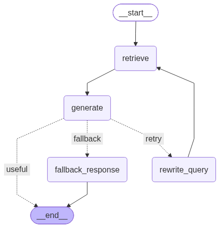

# Self-Healing RAG Pipeline (Agentic Cyclic Retrieval)

An Agentic Retrieval-Augmented Generation (RAG) system built with **LangGraph** that moves beyond naive linear chains. It evaluates candidate responses using an internal **Critic Agent**, autonomously identifies hallucinations or retrieval gaps, reformulates failed search queries through cyclical loops, and degrades gracefully when facts are absent.



---

## The Problem

Standard (Linear) RAG pipelines follow a rigid path:
$$\text{User Query} \longrightarrow \text{Retrieve Chunks} \longrightarrow \text{LLM Output}$$

When a user asks a trap question or context is missing:

1. **Hallucination:** The LLM fills gaps by inventing policies or numbers not present in the document.
2. **Silent Failure:** The system provides inaccurate or ungrounded responses with high confidence.

## The Solution: Self-Healing Architecture

This system models retrieval as a **cyclical state machine** using LangGraph:

1. **Retrieve:** Extracts top-$k$ ($k=2$) relevant chunks using FAISS dense vector search.
2. **Generate:** Produces a context-constrained response strictly bounded by retrieved text.
3. **Critic Audit:** A zero-shot auditor evaluates whether every claim in the answer is grounded in the retrieved context.
4. **Autonomous Query Rewriting:** If the answer is ungrounded or incomplete, the critic rejects the output and triggers a semantic reformulation of the search query.
5. **Bounded Retries & Graceful Fallback:** If retries reach the threshold ($N=2$), the pipeline degrades to a clean fallback message instead of fabricating data.

---

## Architecture Flow

[Start]
│
▼
[Retrieve Chunks] ────► [Generate Answer]
│
▼
[Critic Agent]
│
┌──────────────┴──────────────┐
[Grounded: Pass]              [Reject / Missing]
│                             │
▼                             ▼
[END]                   [Retry Loop Check]
├── Retries < 2 ──► [Rewrite Query] ──► (Back to Retrieve)
└── Retries >= 2 ─► [Graceful Fallback] ──► [END]

---

## Tech Stack

* **Orchestration:** LangGraph, LangChain Core
* **Embeddings:** HuggingFace (`sentence-transformers/all-MiniLM-L6-v2`)
* **Vector Store:** FAISS (Facebook AI Similarity Search)
* **LLM Engine:** Groq API (`openai/gpt-oss-120b`)
* **Frontend:** Streamlit
* **Document Chunking:** `RecursiveCharacterTextSplitter` (chunk size: 200, overlap: 20)

---

## Benchmark Results (Edge Cases)

### Test Case 1: Grounded In-Context Query

* **Query:** `"What is the company's general return policy?"`
* **Workflow:** `Retrieve` $\rightarrow$ `Generate` $\rightarrow$ `Critic (YES)` $\rightarrow$ `END`
* **Output:** `"The company offers a 30-day return policy for all products."` (Accepted on Cycle 0)

### Test Case 2: Trap Query (Missing Information)

* **Query:** `"What is the refund policy for software subscriptions, and what discount do annual subscribers get?"`
* **Workflow:**
  * Cycle 0: Critic rejected ungrounded answer $\rightarrow$ Reformulated query to focus on subscription policies
  * Cycle 1: Critic rejected partial match $\rightarrow$ Reformulated query to focus on annual discount percentages
  * Cycle 2: Max retries exhausted $\rightarrow$ Routed to Fallback Node
* **Output:** `"I don't have enough information in the provided documents to answer your question."`

---

## Getting Started

### 1. Clone & Set Up Virtual Environment

```bash
git clone [https://github.com/riddhijain1003/self-healing-rag.git](https://github.com/riddhijain1003/self-healing-rag.git)
cd self-healing-rag
python3 -m venv venv
source venv/bin/activate
pip install -r requirements.txt


2. Environment Variables

Create a .env file in the root directory:

GROQ_API_KEY=your_groq_api_key_here


3. Run the CLI Pipeline

python main.py


4. Run the Streamlit Interface

python -m streamlit run app.py


---

### Push Changes to GitHub

Save the file (`Cmd + S`) and push your final commit from the terminal[span_1](start_span)[span_1](end_span):

```bash
git add README.md
git commit -m "docs: add comprehensive architecture and benchmark documentation"
git push origin main
